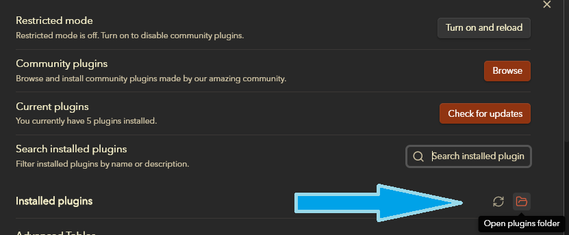

How to start contributing:
1. Fork the repository
2. Clone your forked repository to your local machine
3. You'll need to run `npm install` to acquire all the dependencies. You have two options:
   1. installed Node.js on your machine
   2. use the DevContainer provided in the repository, but this assumes you have Docker installed on your machine
4. Make your changes. Most likely to `main.js`, `Plugin.ts`, `PluginSettingsTab.ts`, and `styles.css`
5. Run `npm run build` to compile your changes
6. Copy the `main.js` and `styles.css` files from the root of the project, to the Plugin folder.

_How do I find the plugin folder?_
- Easiest thing to do, is to install the official plugin from the within the Obsidian app.
- Then go to the Settings, and go to the *Community Plugins* section. From there, you can click on the *Folder* button to open the plugin folder.
- 
- Drill down into the Background plugin directory, and replace the `main.js` and `styles.css` files with your updated files.
