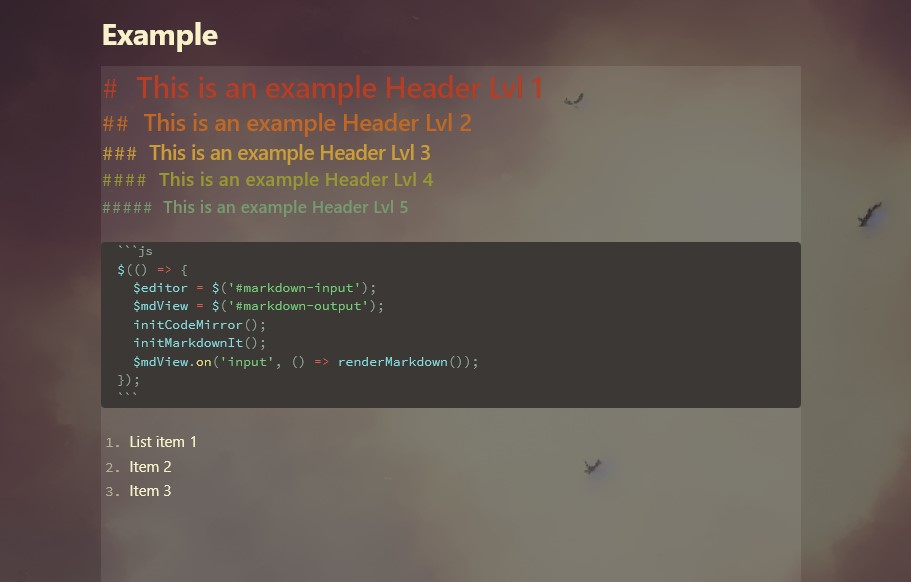
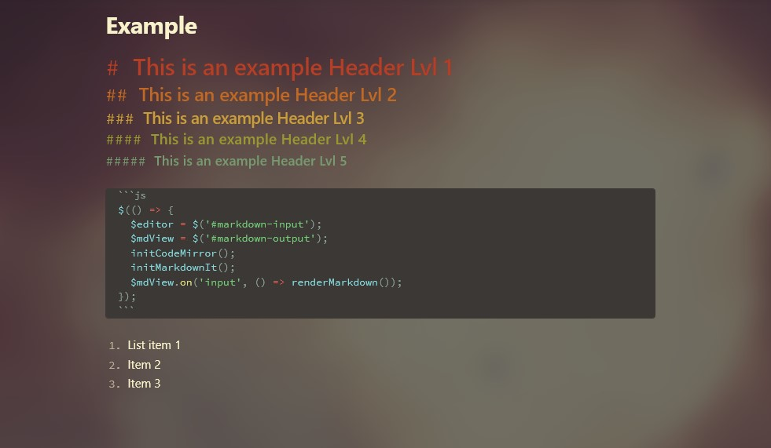

# Obsidian Editor Background Plugin

This is in early development, and likly won't see many changes unless I receive issues or PRs.
Of course, if I desire something new, I'll add it. But from what I've heard from similar editor communities,
this isn't a sought-after feature, so I don't really expect anyone else other than myself to use this.

## Example 1

This example uses no bluriness and default input area contrast.

## Example 2

This example uses high degree of bluriness, with no input area contrast.
