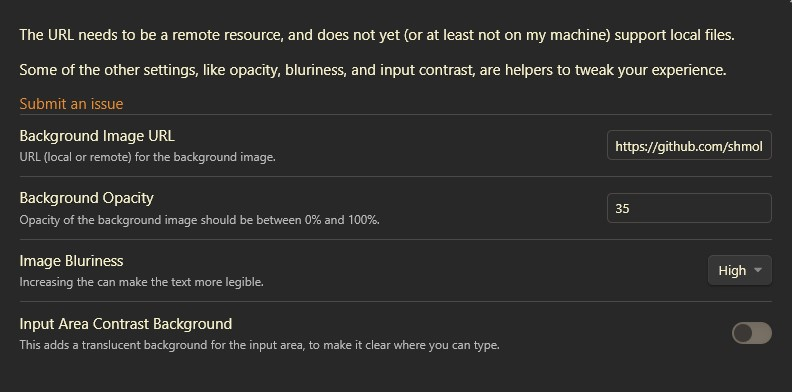
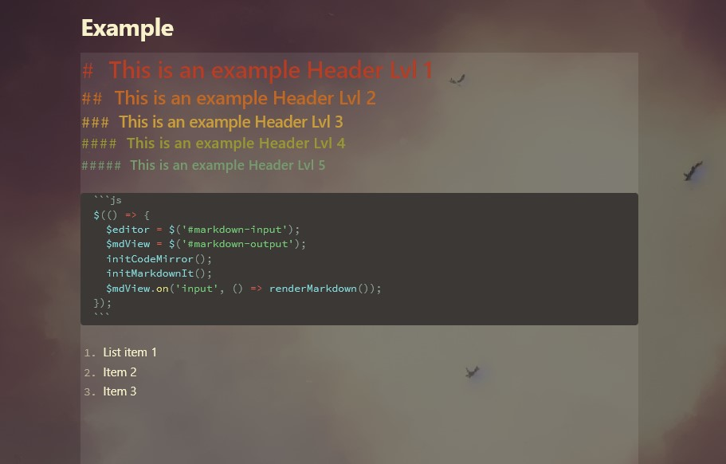
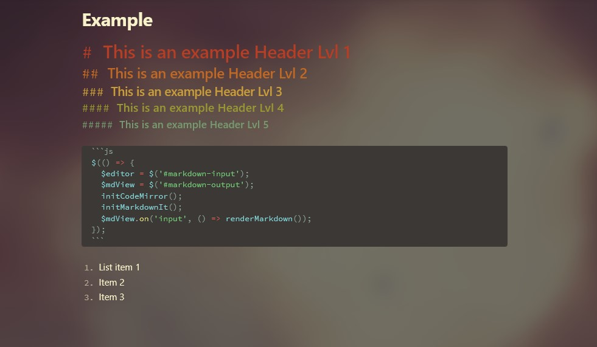

# Obsidian Editor Background Plugin

This plugin is meant to provide an aesthetic background for the Editor view of Obsidian.
It currently only supports remote assets, so you'll need to host your own images.

As part of the settings, there's additional tweaking that's available:

- **Background image URL** — the remote image to display.
- **Dark theme image URL** — an optional second image used while the dark theme is active.
- **Background opacity** — fade the image so text stays legible.
- **Image blur** — blur the image to reduce visual noise.
- **Input area contrast background** — a translucent backdrop behind the text for legibility.
- **Image position** — anchor the image to the center, an edge, or a corner.
- **Image scaling** — fill (crop), fit, stretch, or actual size.
- **Apply to entire window** — show one image behind the whole window (including sidebars)
  instead of a separate copy in each pane.
- **Excluded paths** — folders or notes that should not show the background.

I use animated gifs as my background, particularly ones by [waneella](https://waneella.com/).

## Settings Menu

## Example 1

This example uses no bluriness and default input area contrast.

## Example 2

This example uses high degree of bluriness, with no input area contrast.
